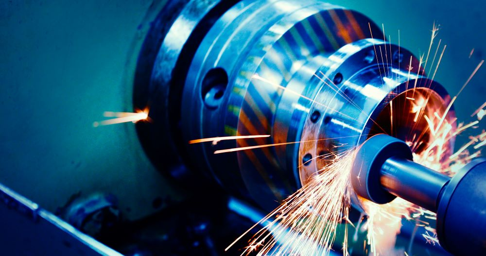
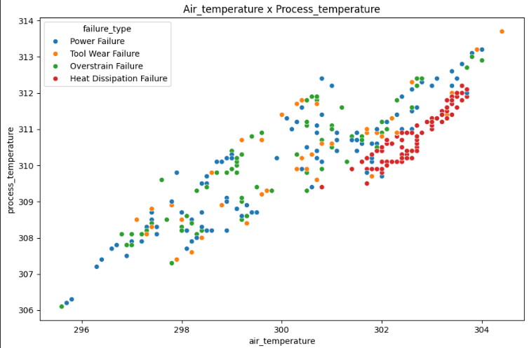
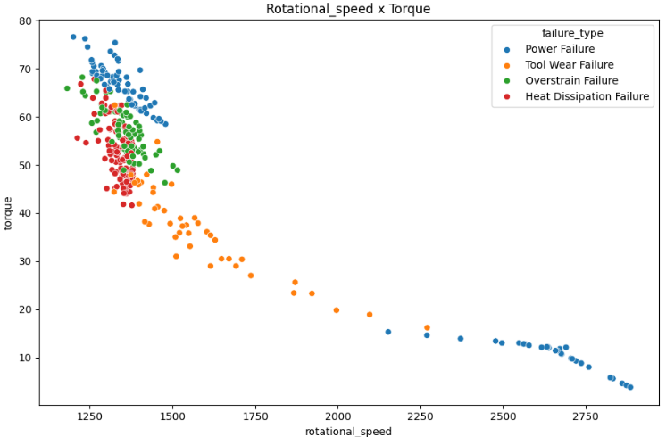
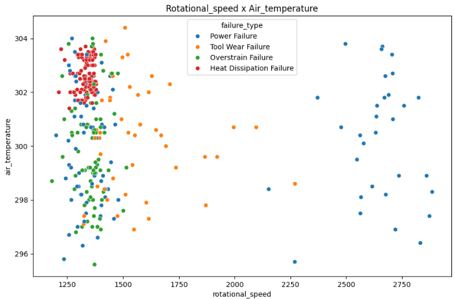
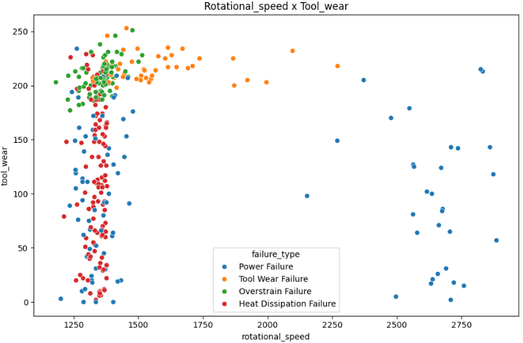
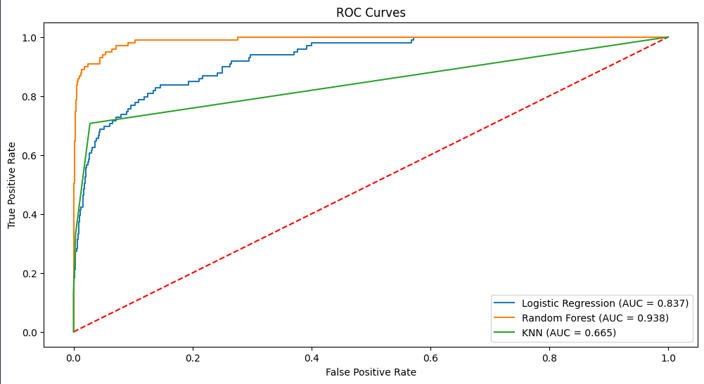
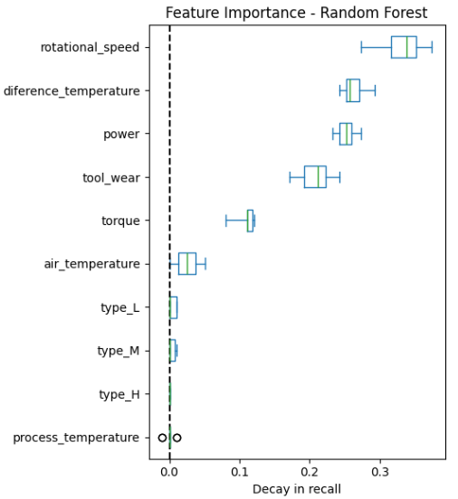
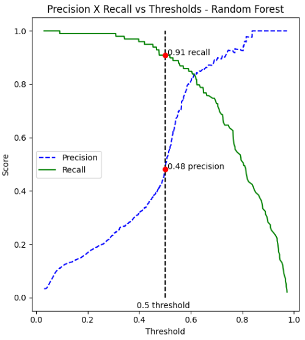
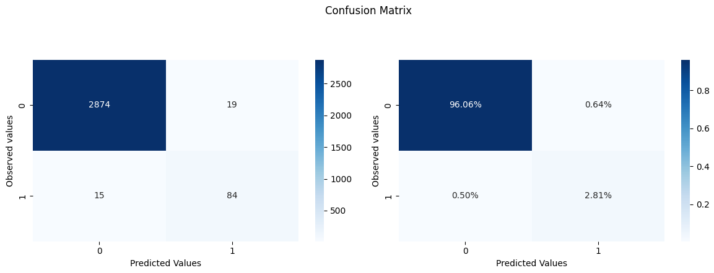

# Machine Predictive Maintenance Binary Classification



## Dataset
The dataset for this project can be found on [Kaggle](https://www.kaggle.com/datasets/shivamb/machine-predictive-maintenance-classification) (licensed under CC0: Public Domain). 

Since real predictive maintenance datasets are generally difficult to obtain and in particular difficult to publish, the creators built this dataset on synthetic data that reflects real predictive maintenance encountered in the industry to the best of their knowledge. The dataset consists of 10000 rows with 10 columns:

- **UID**: Unique identifier ranging from 1 to 10000
- **Product ID**: Consisting of a letter L, M, or H for low (50% of all products), medium (30%), and high (20%) as product quality variants and a variant-specific serial number
- **Air temperature [K]**: Generated using a random walk process later normalized to a standard deviation of 2 K around 300 K
- **Process temperature [K]**: Generated using a random walk process normalized to a standard deviation of 1 K, added to the air temperature plus 10 K
- **Rotational speed [rpm]**: Calculated from powepower of 2860 W, overlaid with a normally distributed noise
- **Torque [Nm]**: Torque values are normally distributed around 40 Nm with an σ = 10 Nm and no negative values
- **Tool wear [min]**: The quality variants H/M/L add 5/3/2 minutes of tool wear to the used tool in the process and a 'machine failure' label that indicates whether the machine has failed in this particular data point for any of the following failure modes are true

There are two targets present in this dataset. One for binary classification ("Target") and the other for multiclass classification ("Failure Type").
- **Target**: Failure or Not
- **Failure Type**: Type of Failure

## Objectives
The main objective of this project is:

**To develop a system that will be able to detect what machines will need maintenance before they present a failure**

To achieve this objective, it was further broken down into the following technical sub-objectives:

1. To perform in-depth exploratory data analysis of the dataset
2. To engineer new predictive features from the available features
3. To develop a supervised model to classify behaviour into no failure and failure
4. To create an API for the trained model and enable the user to input data to make a prediction and deploy it

## Main Insights
From the exploratory data analysis, these were the main points that stood out:
- The `target` column is extremely unbalanced, with more than 96% of all data on the "no failure" class, determined by the 0
- The **heat dissipation** failure is concentrated where `air_temperature` and `process_temperature` indicates high values
  


- `Rotational_speed` and `torque` present opposite behaviors. Failures are very concentrated when `rotational_speed` indicates a low value and, when `torque` indicates high values
  


- There are two types of failures that only occurs when the rotational speed is below 1500 rpm, with the **heat dissipation** failure completely dependent on the temperatures and the **overstrain** failure dependent on high `torque` and high `tool_wear`
        

## Engineered Features
From the knowledge gained during the EDA, the following features were created:
- `diference_temperature`: This feature can help detect all failures that occur when the temperatures are high, especialy everytime that theres a heat dissipation failure
- `power`: This feature can help detect all power failures

## Models

### Model performance
For the modeling phase, three models were used: Logistic Regression, Random Forest and KNN. Each model was trained and tested using the original dataset and the new dataset that contains the new engineered features. During each training and testing, two methods were used to solve the imbalance issue of the target. The first one was using the parameter `class_weight` on the models that have it. The second method was the utilization of `SMOTE`, an oversampling method that uses synthetic data to balance the target. `SMOTE` was only applied to the training sets, with the tests sets having the original imbalance of the data.
Since this is a binary classification problem, the models were evaluated by their `AUC` score, and by the `recall` and `f1` metrics, with `recall` being the most important. The best performing model was the **Random Forest** when trained with the new features and using the `class_weight` parameter. 



The **Random Forest** had a much superior score, at 0.938, way ahead of the other models.

### Model Explainability



The **Random Forest** had a well balanced feature importance distribution in terms of decay in recall. The new features are tied for second and third place, with only `rotational_speed` being considered more important and `tool_wear` in fourth place. This means that the feature engineering effort was successful.

## Model Selection

Despite having a very good `AUC` score, the model showed that by changing its threshold, it could get a better performance in terms of `f1`.



By changing the threshold to 0.6, there would be minimal `recall` loss and a very big gain on `precision`. 



When adjusting the threshold, the model had only 15 false negatives and 19 false positives, for a total of 34 errors. The second best model had fewer false negatives (11), but 35 false positives. Assuming that the best financial outcome for the company is a model that has the least possible number of false negatives but don't want to keep sending machines for maintenance on false alarms (high number of false positives), this model was selected for deployment. The model parameters are:
```json
{
    class_weight: "balanced",
    criterion: "entropy",
    max_depth: 5,
    max_features: "sqrt",
    n_estimators: 50,
    random_state: 42
}
```


